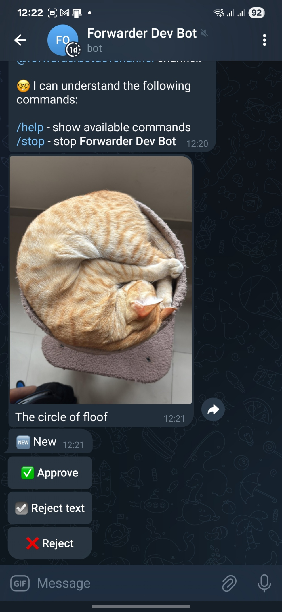
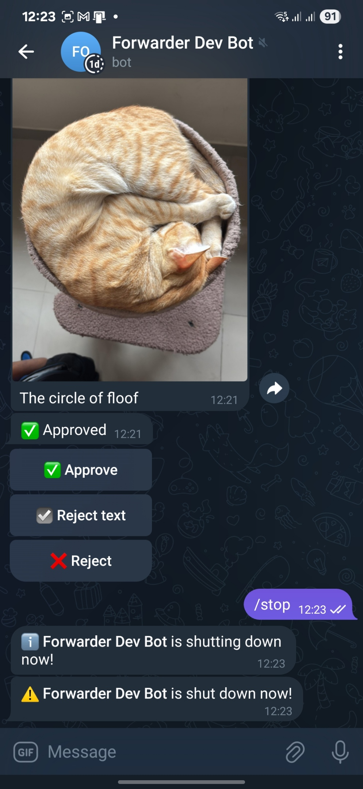

# 🤖 Telegram Forwarder Bot

A Spring Boot-based Telegram bot that forwards posts from external sources (e.g., Reddit) to a Telegram channel.
Currently, the bot can only forward posts from a single subreddit.

## 📋 Requirements

* Java 21
* A [Reddit](https://www.reddit.com/) account.
* A [Telegram](https://telegram.org/) account.
* A [Telegram Channel](https://telegram.org/tour/channels) to forward posts to.

## 🚀 Quick Start

1. Go to https://www.reddit.com/prefs/apps and create an app.

    * `name`: Your app name.
    * `type`: `script`.
    * `redirect uri`: Any valid URL (e.g., your GitHub repository URL).
    * Other fields are optional.

2. Create a new Telegram bot using [BotFather](https://t.me/botfather) and get the bot token.

    * [How Do I Create a Bot?](https://core.telegram.org/bots#how-do-i-create-a-bot)

3. Add the bot to your Telegram channel as an administrator with the permission to post messages.

4. **Important:** Send `/start` message to the bot in Telegram before running it for the first time.

5. Download an executable JAR file from
   the [latest release](https://github.com/yvasyliev/telegram-forwarder-bot/releases/latest).

6. Provide the [mandatory application properties](#mandatory-properties).

7. Run the bot:

   ```bash
   java -jar $PATH_TO_JAR_FILE
   ```

## ⚙️ Application Properties

The bot is built with Spring Boot and is configurable with the application properties like a regular Spring Boot
application. It's recommended to store any secrets/tokens in environment variables.

### 🔒 Mandatory Properties

Without these properties, the bot will not start:

<table>
  <tr>
    <th>Property</th>
    <th>Description</th>
  </tr>
  <tr>
    <td><code>reddit.subreddit</code></td>
    <td>The name of the subreddit to forward posts from without the <code>r/</code> prefix.</td>
  </tr>
  <tr>
    <td><code>reddit.username</code></td>
    <td>Your Reddit username without the <code>u/</code> prefix. Required to access the Reddit API.</td>
  </tr>
  <tr>
    <td>
      <div><code>spring.security.oauth2.client.registration.reddit.client-id</code></div>
    </td>
    <td>Your Reddit app client ID.</td>
  </tr>
  <tr>
    <td>
      <div><code>spring.security.oauth2.client.registration.reddit.client-secret</code></div>
    </td>
    <td>Your Reddit app client secret.</td>
  </tr>
  <tr>
    <td><code>telegram.admin-id</code></td>
    <td>
      Your Telegram user ID (not your username!). The bot will send you posts for moderation before forwarding them to
      the channel, and important errors. Example: <code>390000000</code>
      <ul>
        <li>
          <a href="https://www.google.com/search?q=How+to+find+your+User+ID+in+Telegram%3F">
            How to find your User ID in Telegram?
          </a>
        </li>
      </ul>
    </td>
  </tr>
  <tr>
    <td><code>telegram.bot.token</code></td>
    <td>Your Telegram bot token. Example: <code>123456789:ABCdefGhIJKlmnoPQRstuVWXyZ</code></td>
  </tr>
  <tr>
    <td><code>telegram.channel-username</code></td>
    <td>
      The username (with <code>@</code> prefix!) or the ID of the Telegram channel to forward posts to. Example:
      <code>@my_channel</code> or <code>-1001234567890</code>
    </td>
  </tr>
</table>

### 🧩 Optional Properties

You can override the default values of these properties:

<table>
  <tr>
    <th>Property</th>
    <th>Default Value</th>
    <th>Description</th>
  </tr>
  <tr>
    <td><code>logging.telegram-bot-appender.enabled</code></td>
    <td><code>true</code></td>
    <td>
      Whether to enable the Telegram bot logging appender. If disabled, the bot will not send any logs to the admin
      user.
    </td>
  </tr>
  <tr>
    <td><code>logging.telegram-bot-appender.level</code></td>
    <td><code>warn</code></td>
    <td>
      The logging level for the Telegram bot logging appender. Defines the severity of log statements that will be sent
      to the admin user.
    </td>
  </tr>
  <tr>
    <td><code>scheduler.post-forward.enabled</code></td>
    <td><code>true</code></td>
    <td>Whether to forward posts from external sources to the admin user for moderation.</td>
  </tr>
  <tr>
    <td><code>scheduler.post-forward.fixed-delay</code></td>
    <td><code>1m</code> (1 minute)</td>
    <td>
      The fixed delay between post forwarding attempts. Defines how often the bot checks for new posts to forward to
      the admin user.
    </td>
  </tr>
  <tr>
    <td><code>scheduler.post-publisher.cron</code></td>
    <td><code>0 30 8-21 * * *</code> (every 60 minutes from 8:30 to 21:30)</td>
    <td>
      The Spring cron expression for the post publisher scheduler. Defines how often the bot forwards approved posts
      to the Telegram channel.
    </td>
  </tr>
</table>

Check the [application.yml](src/main/resources/application.yml) for even more configuration options.

## 🛠️ Building from Source

To build the bot from source, you need to have JDK 21 installed. You can use the following commands to build the bot
(assuming you have cloned the repository and are in the project root directory):

* On Linux/macOS:

  ```bash
  ./gradlew build
  ```

* On Windows:

  ```bash
  gradlew.bat build
  ```

The command will compile the code, run tests, and create an executable JAR file in the `build/libs` directory.

## ✨ Features

* The bot sends posts to the admin user for moderation before forwarding them to the channel.
* The admin user can manage the posts by interacting with the inline buttons sent by the bot.
* For each post, the admin user can:
    * Approve the post.
    * Approve the post, but remove the caption.
    * Reject the post.
* Only approved posts are forwarded to the Telegram channel.
* The bot uses Spring Security features to prevent unauthorized command execution. Only the admin user can `/stop` the
  bot.
* The bot stores the state of forwarded posts in an H2 database, so it can be restarted without losing the state. By
  default,
  the database is stored in the `data.mv.db` file next to the JAR file.
* The bot supports logging to a Telegram chat, so you can receive logs and errors directly in Telegram.
* The bot sends notifications to the admin user every time it starts or stops.

### 💬 Bot Commands

| Command  | Description                           |
|:--------:|:--------------------------------------|
| `/help`  | Sends the list of available commands. |
| `/start` | The same as `/help`.                  |
| `/stop`  | Stops the bot.                        |


<details>
<summary>🖼️ Screenshots</summary>








</details>

## ⚠️ Limitations

* The bot currently supports only one subreddit.
* The bot does not support forwarding posts of all types (e.g., it does not support forwarding polls).
* Only one Telegram channel can be configured for forwarding posts.
* Only one admin user can be configured for moderation.
* The bot takes up to 60 seconds to shut down gracefully. The bot may notify you that it has stopped after the `/stop`
  command, but the Java process will actually continue running for a few seconds more, so please be patient and wait
  until the process exits with the code `0`.

## 🗺️ Long-Term Plans

* Extract Telegram bot and post source services into separate modules to allow for easier extension and
  customization (e.g., don't use Reddit as source).
* Support multiple subreddits.
* Support multiple Telegram channels.
* Support multiple admin users.
* Support X (Twitter) and Instagram as external sources.
* Select medias to forward from a media group (e.g., forward only first two images from a group of 10 images) by the
  inline buttons.

## 🆘 Getting Help

If you have any questions, issues or suggestions, feel free to check the
[Issues](https://github.com/yvasyliev/telegram-forwarder-bot/issues) section of the repository or create a new issue.

## 🤝 Contributing

We welcome contributions of any kinds! Please read our [contribution guidelines](.github/CONTRIBUTING.md) before
submitting a pull request.

## ⚖️ License

This project is licensed under the [MIT License](https://opensource.org/license/mit).
